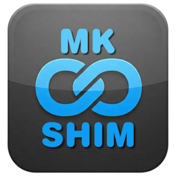

# MkShim



## Installation

MkShim implements copy-single-file deployment. You can download the executable from the latest [Release page](https://github.com/oleg-shilo/mkshim/releases) and simply run it from the desired folder. That's it.

However if you want a convenient way for upgrading you can install [install MkShim from WinGet](https://winstall.app/apps/oleg-shilo.mkshim):

```
winget install --id=oleg-shilo.mkshim  -e
```

# Overview

_Special thanks to @mdnava who helped a lot with the requirements definition and styling the product._

MkShim is a simple application for creating shims on Windows.

The problem it is trying to solve is a lack of good technical solutions for executable aliases on Windows. While on linux the things are much simpler, on Windows symbolic links are not as efficient as they do not handle well executables that have dependencies.

Chocolatey (the Package Manager for Windows) has solved this problem by implementing its own shim generation tool [ShimGen.exe](https://docs.chocolatey.org/en-us/features/shim). However this tool is not available unless the target system has Chocolatey installed.

MkShim is a simple alternative tool that delivers the same functionality as ShimGen and is distributed independently and under MIT licence.

## Creating shims with mkshim

```txt
Usage:
   mkshim <shim_name> <target_executable> [--params:<args>]

--version | -v
    Prints MkShim version.
--params:<args> | -p:<args>
    The default arguments you always want to pass to the target executable.
    IE with chrome.exe shim: 'chrome.exe --save-page-as-mhtml --user-data-dir="/some/path"'
--icon:<iconfile>
    The custom icon to be embedded in the shim. If not specified then the icon will be resolved in the following order:
    1. The application package icon will be looked up in the current and parent folder.
       The expected package icon name is `favicon.ico` or  `<app>.ico`.
    2. The icon of the target file.
    3. MkShim application icon.
--noOverlay
    Disable embedding 'shim' overlay to the application icon of the shim executable.
    By default MkShim always creates an overlay to visually distinguish the shim from the target file.

You can use special MkShim arguments with the created shim:
 --mkshim-noop
   Execute created shim but print <target_executable> instead of executing it.
 --mkshim-test
   Tests if shim's <target_executable> exists.
```

Thus, if you want to create a shim `ntp` for launching `notepad.exe`, then you can achieve this by simply executing the following command from the terminal:

```txt
mkshim C:\ProgramData\chocolatey\bin\ntp.exe C:\Windows\System32\notepad.exe
```

In the example above, the shim is created in the Cocolatey bin folder in the system PATH.

> [!NOTE]
> The mkshim CLI parameter `--params:args` deserves special mention. It is a very powerful option for creating shims that are pre-filled with some parameters useful in cases when the user always wants to start the application with some default parameters. Some examples:
> - Start SQL Server Management Studio with a specific DB connection
> - Start PoewShell terminal with specefic theme
> - Start portable Chrome with a custom user data directory
> 
> When you embed default parameters in the shim, you may need to handle quotation mark characters or spaces. In such cases, you should rely on standard Windows escaping techniques.  
> _Example (courtesy of @mdnava):_
> You want to create a shim for running chrome with two parameters `--save-page-as-mhtml --user-data-dir=\"%LOCALAPPDATA%\ChromeTest\"`
> The following command will create the required shim:
> ```cmd
> mkshim.exe .\ChromeTest.exe %Programs%\Chromium\chrome.exe --params:"--save-page-as-mhtml --user-data-dir=\"%LOCALAPPDATA%\ChromeTest\""
> :: or
> mkshim.exe .\ChromeTest.exe %Programs%\Chromium\chrome.exe "--params:--save-page-as-mhtml --user-data-dir=\"%LOCALAPPDATA%\ChromeTest\""
> ```

## Using shims

When it comes to working with the shims you created, it is always useful to be able to extract the information about the shim's target file details (e.g. path).
You can do this by executing the shim with the special mkshim-specific command line parameters: 
_IE rc.exe shim is created for the Windows SDK resource compiler rc.exe_

- `--mkshim-noop` prints shim mapping info
  ```txt
  D:\tools\>rc.exe --mkshim-noop
  Executing shim in 'no operation' mode.
  Target: C:\Program Files (x86)\Windows Kits\10\bin\10.0.22621.0\x64\rc.exe
  Default params: 
  ```
- `--mkshim-test` prints shim mapping info
  ```txt
  D:\tools\>rc.exe --mkshim-test
  Success: target file exists.
  Target: C:\Program Files (x86)\Windows Kits\10\bin\10.0.22621.0\x64\rc.exe
  ```
However, the above options are unavailable if your shim is a Windows executable, not a console application. In such cases, you can use rather excellent PE metadata reader tool from Sysinternals [Sigcheck]([url](https://winstall.app/apps/Microsoft.Sysinternals.Sigcheck)):

```txt
D:\tools>sigcheck rc.exe

Sigcheck v2.90 - File version and signature viewer
Copyright (C) 2004-2022 Mark Russinovich
Sysinternals - www.sysinternals.com

d:\tools\rc.exe:
        Verified:       Unsigned
        Link date:      1:11 PM 22/03/2025
        Publisher:      n/a
        Company:        n/a
        Description:    Shim to rc.exe (created with mkshim v1.1.0.0); Default params: 
        Product:        C:\Program Files (x86)\Windows Kits\10\bin\10.0.22621.0\x64\rc.exe
        Prod version:   10.0.22621.3233
        File version:   10.0.22621.3233 (WinBuild.160101.0800)
        MachineType:    64-bit
```
